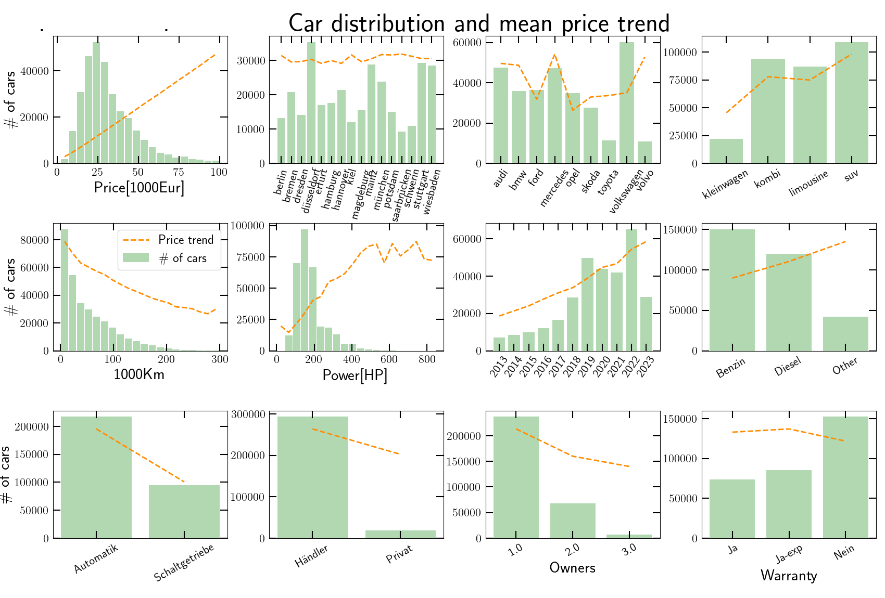

# autoscout24_prices_study

A study of what determines the price of used cars on sale in the german website [autoscout24.de](https://www.autoscout24.de/).

These python scripts execute two main tasks: 
1. scrape the autoscout24.de webpages to extract car data for different german cities, car brands and body types.
2. train machine learning models to predict car prices and study the relative importance of different car features to the final price.

This figure shows the outcome of one of the best models:

1. the engine power is the most important feature in setting the car price, followed by the car year and the number of kilometers. 
2. Beyond that, the fuel type (diesel, petrol, eletric), type of transmission (auto vs. manual), car brand and chassis type have also a visible importance.
3. The warranty type, city, number of owners and seller type (handler vs. private) play a negligible role.


## Table of contents
- [The car data](#the-car-data)
- [Machine learning model performance](#machine-learning-model-performance)
- [Code overview](#code-overview)

## The car data

This figure shows the number of cars as a function of the features (green bars). The orange line shows the price trend, ie. the mean price per feature normalized by a constant to fit in the plot (note this is not the actual price, just how it varies on average across features).



## Code overview

#### Dependencies

- numpy, scipy and matplotlib
- pandas
- scikit-learn

To run the whole pipeline, open a terminal and execute the scripts as follows:

```
python scrape_autoscout24_de.py; python prepare_training_data.py; python plot_data_stats.py; python train_regression_models.py; python plot_feature_importance.py
```

#### parameters.py
This file defines the car search parameters. Edit it to choose which brands, chassis types and cities to browse on autoscout24.de.

Other global functions, parameters and library imports are also specified here. This file is called by all other files.

#### scrape_autoscout24_de.py
This file does the autoscout24.de scraping. The main search loop is:

```ruby
# Loop over the cities
for city in city_list:
    print ('Doing city', city[0], 'out of', [a[0] for a in city_list])

    # Loop over the brands
    for brand in brand_list: # loop over brands
        print ('    Doing brand', brand, 'out of', brand_list)

        # Loop over the body types
        for body in body_types: # loop over body types
            print ('        Doing body type', body, 'out of', body_types)

            # Get car URLs
            print ('            Getting car URLs ... ')
            cars_URL = get_cars_URL(city, brand, body)
            print ('            ... done! Number of URLs:', len(cars_URL))

            # Get and save car data from URLs
            print ('            Getting car data ... ')
            cars_data = save_car_data(filename, cars_URL, city, brand, body)
```

The function *get_cars_URL()* first collects all desired car URL addresses, which the function *save_car_data()* then scrapes to extract the car properties. The car properties are:

| price | city | brand | body | km  | power | year | fuel | transmission | seller | owners | warranty type |
| :---: | :--: | :---: | :--: | :-: | :---: | :--: | :--: | :---------:  | :----: | :----: | :-----------: |

The data is saved in the file *data_store/data_store/data_cars_autoscout24.csv*. The folder *data_store/* contains already data from some searches. To extract all of the data for a single city, single car brands and 4 chassis types it takes about 30m (depending on the internet speed and CPU).

#### prepare_training_data.py
This files prepares the car data for training:
1. it deals with missing values;
2. does feature engineering;
3. encodes categorical variables;
4. splits into training/validation data (80/20\%).

#### plot_data_stats.py
This file simply plots a few basic data statistics: the number of cars as a function of car features and the correlation between car features.

#### train_regression_models.py
This file defines, trains and saves different regression models: (i) linear regression, (ii) k nearest neighbors, (iii) decision tree, (iv) random forest and (v) multi-layer perceptron. It also compares their performance in truth vs. predicted price plots. Executing *python  train_regression_models.py* will train the models and produce a figure with the model comparison.

The snippet with the model definitions:

```ruby
# Linear regression
print ('Fitting linear regression model ... ')
model_1 = linear_model.LinearRegression(fit_intercept=True)
model_1.fit(train_features, train_labels)
pickle.dump(model_1, open('model_store/model_1_lin_regression.pickle', 'wb'))

# K Nearest Neighbors
knn = 11
print ('Fitting k nearest neighbors model ( k = ',knn,') ... ')
model_2 = neighbors.KNeighborsRegressor(n_neighbors=knn)
model_2.fit(train_features, train_labels)
pickle.dump(model_2, open('model_store/model_2_kNearestNeighbors.pickle', 'wb'))

# Decision tree
print ('Fitting decision tree model ... ')
model_3 = tree.DecisionTreeRegressor(splitter='random')
model_3.fit(train_features, train_labels)
pickle.dump(model_3, open('model_store/model_3_decision_tree.pickle', 'wb'))

# Random forest
n_trees = 25
print ('Fitting random forest model ( Ntrees = ',n_trees,') ... ')
model_4 = ensemble.RandomForestRegressor(n_estimators=n_trees)
model_4.fit(train_features, train_labels)
pickle.dump(model_4, open('model_store/model_4_random_forest.pickle', 'wb'))

# Multi-layer perceptron (a dense neural network)
layers = np.array([32, 32, 32])
print ('Fitting multi-layer perceptron model ( layers=',layers,') ... ')
model_5 = neural_network.MLPRegressor(layers, activation='relu', solver='adam', 
                                      batch_size='auto', learning_rate_init=0.01, 
                                      shuffle=True, early_stopping=True, n_iter_no_change=10, verbose=False)
model_5.fit(train_features, train_labels)
pickle.dump(model_5, open('model_store/model_5_MLperceptron.pickle', 'wb'))
```

#### quantify_feature_importance.py

This file quantifies the importance of each car feature by randomizing their entries in the data set and measuring the loss in accuracy of the predictions. The greater the accuracy loss, the more important the feature. Executing *python quantify_feature_importance.py* will do the feature importance estimation and produce a plot showing it for all the models.

The code snippet of the feature importance estimation:

```ruby

def get_feature_importance(model, data_features, data_labels):
    N_data     = len(data_features[:,0])
    N_features = len(data_features[0,:])
    # Default model prediction and accuracy
    prediction_default = model.predict(data_features)
    accuracy_default   = np.mean( abs((prediction_default - data_labels)/data_labels) )
    # Measure feature importance by size of accuracy loss after randomization
    feature_importance = np.zeros(N_features)
    for j in range(N_features):
        data_features_now = np.copy(data_features)
        np.random.shuffle(data_features_now[:,j])
        prediction_now = model.predict(data_features_now)
        accuracy_now   = np.mean( abs((prediction_now - data_labels)/data_labels) )
        feature_importance[j] = accuracy_default/accuracy_now
    return feature_importance, accuracy_default

def get_average_feature_importance(model, data_features, data_labels, N_random):
    N_features                 = len(data_features[0,:])
    average_feature_importance = np.zeros(N_features)
    for i in range(N_random):
        average_feature_importance += get_feature_importance(model, data_features, data_labels)[0]
    return average_feature_importance/N_random, get_feature_importance(model, data_features, data_labels)[1]

model_list  = [     model_1     ,       model_2      ,      model_3   ,      model_4   ,         model_5      ]
model_names = ['Lin. regression', 'k near neighbors' , 'Decision tree', 'Random forest', 'Multi-layer percep.']
Nmodels     = len(model_list)

N_random = 10
feature_importance_train_list = []
feature_importance_valid_list = []
for i in range(Nmodels):
    print ('Estimating feature importance by randomization for', model_names[i])
    feature_importance_train_list.append( get_average_feature_importance(model_list[i], train_features, train_labels, N_random)[0] )
    feature_importance_valid_list.append( get_average_feature_importance(model_list[i], valid_features, valid_labels, N_random)[0] )
```

