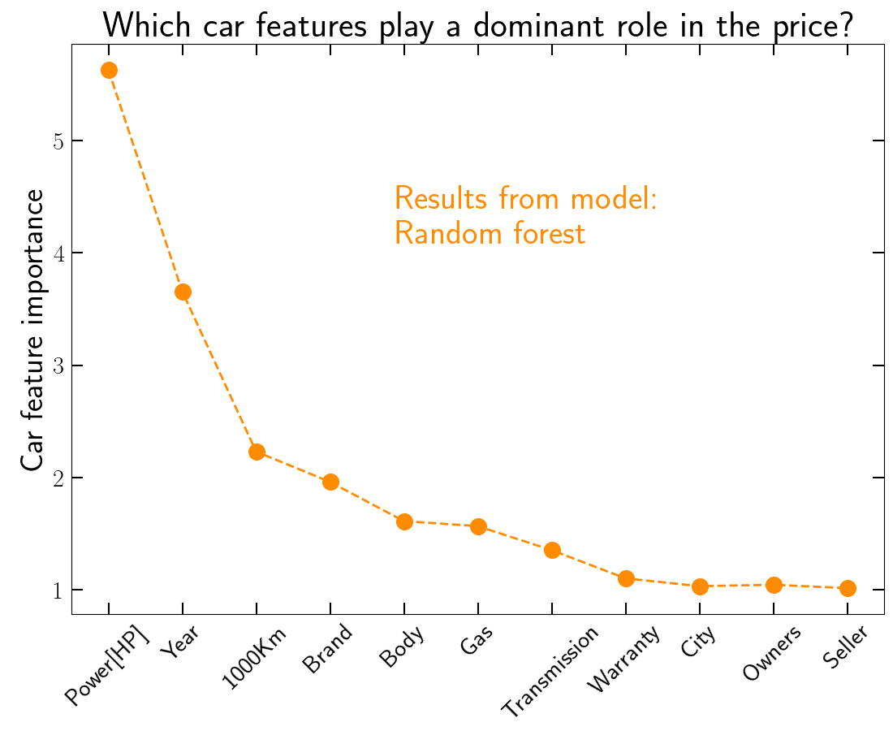
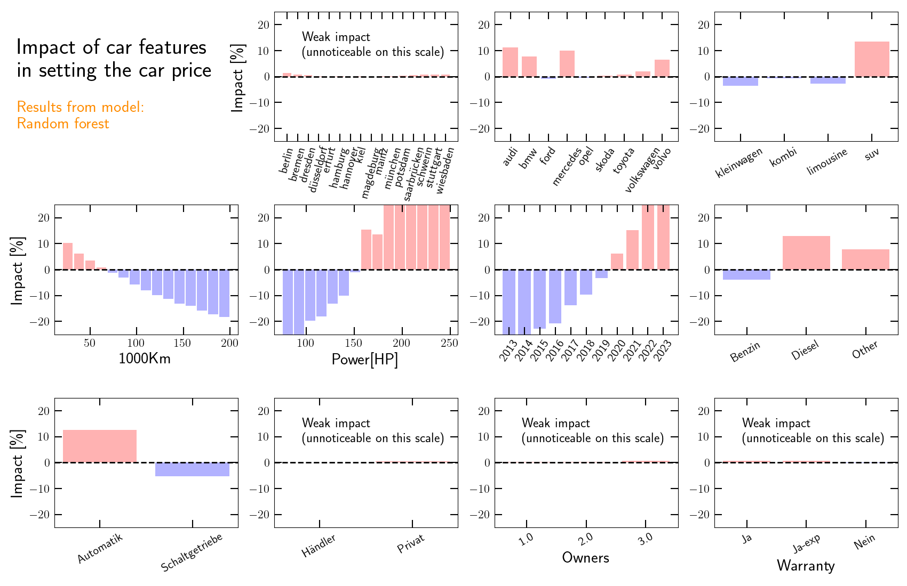
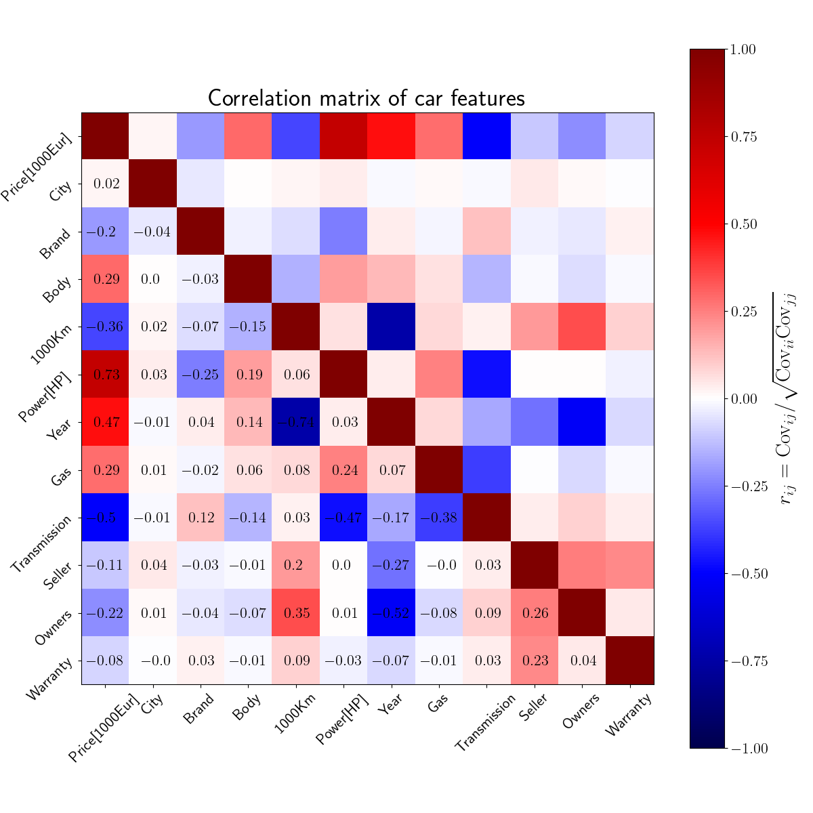
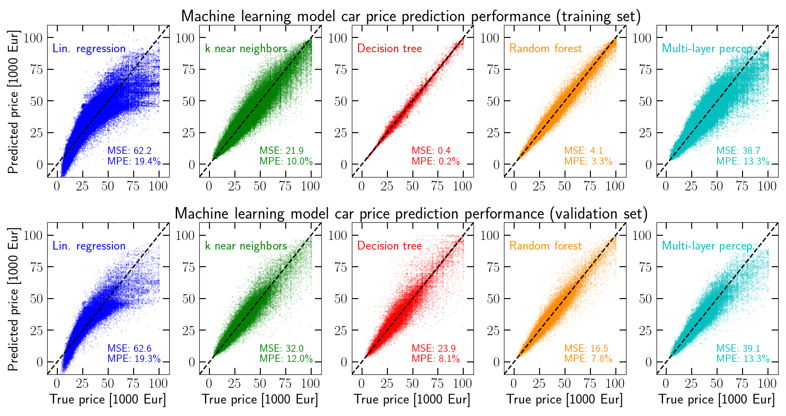
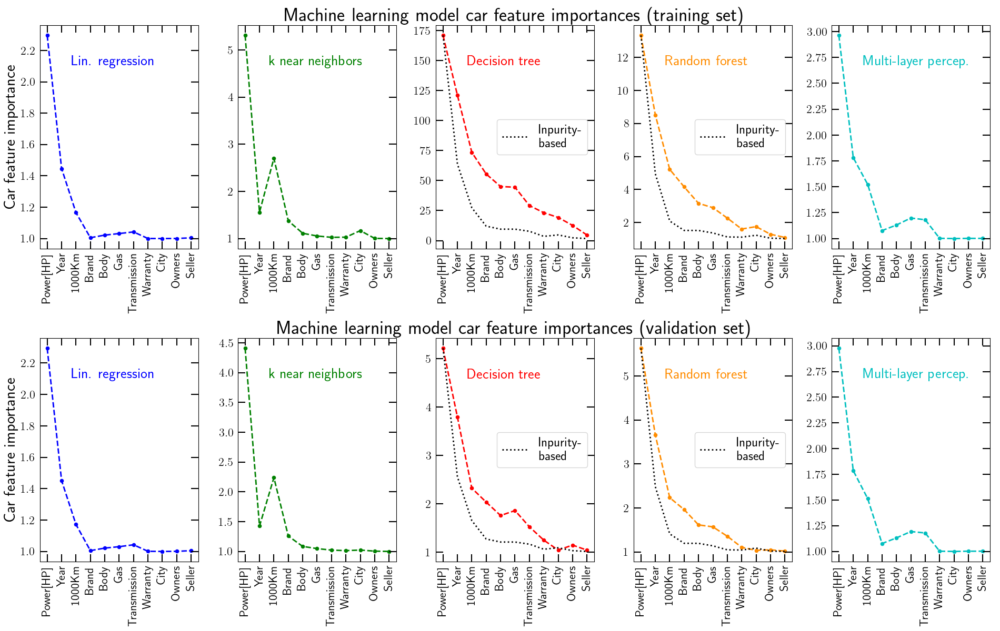

# Car prices on autoscout24.de

A study of what determines the price of used cars on sale in the german website [autoscout24.de](https://www.autoscout24.de/).

These python scripts execute two main tasks: 
1. scrape the autoscout24.de webpages to extract car data for different german cities, car brands and body types.
2. train machine learning models to predict car prices and study the relative importance of different car features to the final price.

<!-- ==================================================================================================================== -->
<!-- ==================================================================================================================== -->
## Table of contents
- [Overview of main results](#overview-of-main-results)
- [Car data overview](#car-data-overview)
- [Machine learning model predictions](#machine-learning-model-predictions)
- [Feature importances from the machine learning models](#feature-importances-from-the-machine-learning-models)
- [Code overview](#code-overview)

<!-- ==================================================================================================================== -->
<!-- ==================================================================================================================== -->
## Overview of main results

This figure shows the outcome of one of the best models (random forest):



|     Strong features    |        Mild features        |          Weak features         | 
| :--------------------: | :-------------------------: | :----------------------------: |  
| power, year, km, brand | chassis, fuel, transmission | warranty, city, owners, seller | 

The next figure shows the impact of each feature: estimated by measuring the percentage change of car prices that do not have that feature, assuming they have that feature. For example, how do prices of non-SUV cars change if they are assumed to be SUV? Answer: 13% more expensive (red bar on the top right panel in the figure).



The main takeaways are:

1. Strong impact (several tens of %) from engine power, kilometers and car year. The price increases for 
    - more powerful cars
    - cars with less kilometers
    - younger cars.
2. Mild impact (5-20%) from brand, chassis type, fuel type and transmission. For example:
    - if all other cars were Mercedes, they would be ~10% more expensive
    - if all other cars were SUV, they'd be 13% more expensive
    - if all other cars were diesel, they'd be 11% more expensive
    - if all manual cars were automatic, they'd be 11% more expensive
3. Weak impact ($\lesssim$ 1\%) from city, seller, number of owners and warranty. This is barely visible on the scale of the plot.

<!-- ==================================================================================================================== -->
<!-- ==================================================================================================================== -->
## Car data overview

The car data was collected for:

- cars after 2013;
- all 16 German state capitals;
- the brands: Audi, BMW, Ford, Mercedes, Open, Skoda, Toyota, Volkswagen and Volvo
- the body (chassis) types: small car (kleinwagen), sedan (limousine), station-wagon (kombi) and SUV.

There is a total of 364,036 cars in the data set (data_store/data_cars_autoscout24.csv).

This figure shows the car feature distribution (green histograms). The orange line shows the price trend: the mean price per feature normalized by a constant to fit in the plot (note this is not the actual price, just how it varies on average across each feature's values).


The next fifugre shows how strongly correlated (or anti-correlated) the different car features are.



For example, the car prices increase with increasing engine power (correlation coefficient of 0.73). Further, the price is anti-correlated with the number of owners (correlation coefficient of -0.22). Of course, *correlation does not imply causation*. The machine learning models discussed next will provide more insights on what actually determines the car prices.

<!-- ==================================================================================================================== -->
<!-- ==================================================================================================================== -->
## Machine learning model predictions

This figure compares the accuracy of 5 regression models in predicting car prices. The models tested are 
1. a linear regression model,
2. a k nearest neighbors model (11 neighbors),
3. a decision tree,
4. a random forest (ensemble of 25 trees),
5. a multi-layer perceptron (dense neural network with 3 32-node hidden layers). 

The upper panels are for the training set and the lower panels for the validation set.



The mean absolute percentage errors on the validation sets are (also listed in the figure panels):

| Lin. regression | k nearest neighbors | Decision tree | Random forest | Multi-layer perceptron | 
| :-------------: | :-----------------: | :-----------: | :-----------: | :--------------------: | 
|      19.1%      |         13.9%       |      12.8%    |      9.8%     |         14.3%          | 

The random forest model performs the best, with a mean percentage error just under 10% on the validation set. The simpler linear regression model performs the worst. The other three models display reasonable accuracy -- note that the decision tree drastically overfits the training set, but performs closer to the other models in the validation set.

<!-- ==================================================================================================================== -->
<!-- ==================================================================================================================== -->
## Feature importances from the machine learning models

This figure shows the importance of the car features in setting the final price. For each model and data set, the feature importances are computed by measuring the loss in accuracy after randomizing each data entries. For example, to measure the importance of the car year, we (i) randomize the year values of the cars, (ii) predict the resulting prices, and (iii) determine the importance as the ratio of the mean percentage error before and after randomization.



A few takeaway points:
1. All models agree that (i) engire power, (ii) car year and (iii) number of kilometers are the most important car features.
2. The linear regression (blue) and k nearest neighbors models (green) predict negligible importance for all other car features.
3. The model that performs the best, the random forest, predicts a small but non-negligible importance of the types of fuel, transmission, brand and chassis. 
4. The warranty type, city, owners and seller type are deemed of negligible importance by the best random forest model. 

In previous figures we saw marked correlations between average car prices and properties with very low feature importance. For example, car prices are on average lower if they are sold privately. These results indicate however that this is because cars sold privately likely have other features that lower their prices. In other words, with everything else fixed, if a car is sold privately this does not penalize its final price.

In the decision tree and random forest panels, we compare also against the feature importances estimated directly by the sklearn functions based on the Gini impurity (shown as the dotted black lines). They agree noticeably well with our own feature importance estimates (just with the exception that the decision tree inpurity-based importance for car transmission is interestingly ranked higher).

<!-- ==================================================================================================================== -->
<!-- ==================================================================================================================== -->
## Code overview

<!-- ==================================================================================================================== -->
<!-- ==================================================================================================================== -->
#### Dependencies

- numpy, scipy and matplotlib
- pandas
- bs4, python web scraping library
- scikit-learn

To run the whole pipeline, open a terminal and execute the scripts as follows:

```
python scrape_autoscout24_de.py; python prepare_training_data.py; python plot_data_stats.py; python train_regression_models.py; python plot_feature_importance.py
```
<!-- ==================================================================================================================== -->
<!-- ==================================================================================================================== -->
#### parameters.py
This file defines the car search parameters. Edit it to choose which brands, chassis types and cities to browse on autoscout24.de.

Other global functions, parameters and library imports are also specified here. This file is imported by all other files.

<!-- ==================================================================================================================== -->
<!-- ==================================================================================================================== -->
#### scrape_autoscout24_de.py
This file does the autoscout24.de scraping. The main search loop is:

```ruby
# Loop over the cities
for city in city_list:
    print ('Doing city', city[0], 'out of', [a[0] for a in city_list])

    # Loop over the brands
    for brand in brand_list: # loop over brands
        print ('    Doing brand', brand, 'out of', brand_list)

        # Loop over the body types
        for body in body_types: # loop over body types
            print ('        Doing body type', body, 'out of', body_types)

            # Get car URLs
            print ('            Getting car URLs ... ')
            cars_URL = get_cars_URL(city, brand, body)
            print ('            ... done! Number of URLs:', len(cars_URL))

            # Get and save car data from URLs
            print ('            Getting car data ... ')
            cars_data = save_car_data(filename, cars_URL, city, brand, body)
```

The function *get_cars_URL()* first collects all desired car URL addresses, which the function *save_car_data()* then scrapes to extract the car properties. The car properties are:

| price | city | brand | body | km  | power | year | fuel | transmission | seller | owners | warranty type |
| :---: | :--: | :---: | :--: | :-: | :---: | :--: | :--: | :---------:  | :----: | :----: | :-----------: |

The data is saved in the file *data_store/data_cars_autoscout24.csv*. The folder *data_store/* contains already data from some searches. To extract the data for a single city, single car brand and 4 chassis types it takes about 30m (depending on the internet speed and CPU).

<!-- ==================================================================================================================== -->
<!-- ==================================================================================================================== -->
#### prepare_training_data.py
This files prepares the car data for training:
1. it deals with missing values;
2. does feature engineering;
3. encodes categorical variables;
4. splits into training/validation data (80/20\%).

<!-- ==================================================================================================================== -->
<!-- ==================================================================================================================== -->
#### plot_data_stats.py
This file plots a few basic data statistics: the number of cars as a function of car features and the correlation between car features.

<!-- ==================================================================================================================== -->
<!-- ==================================================================================================================== -->
#### train_regression_models.py
This file defines, trains and saves different regression models: (i) linear regression, (ii) k nearest neighbors, (iii) decision tree, (iv) random forest and (v) multi-layer perceptron. It also compares their performance in truth vs. predicted price plots. Executing *python  train_regression_models.py* will train the models and produce a figure with the model comparison.

The snippet with the model definitions:

```ruby
# Linear regression
print ('Fitting linear regression model ... ')
model_1 = linear_model.LinearRegression(fit_intercept=True)
model_1.fit(train_features, train_labels)
pickle.dump(model_1, open('model_store/model_1_lin_regression.pickle', 'wb'))

# K Nearest Neighbors
knn = 11
print ('Fitting k nearest neighbors model ( k = ',knn,') ... ')
model_2 = neighbors.KNeighborsRegressor(n_neighbors=knn)
model_2.fit(train_features, train_labels)
pickle.dump(model_2, open('model_store/model_2_kNearestNeighbors.pickle', 'wb'))

# Decision tree
print ('Fitting decision tree model ... ')
model_3 = tree.DecisionTreeRegressor(splitter='random')
model_3.fit(train_features, train_labels)
pickle.dump(model_3, open('model_store/model_3_decision_tree.pickle', 'wb'))

# Random forest
n_trees = 25
print ('Fitting random forest model ( Ntrees = ',n_trees,') ... ')
model_4 = ensemble.RandomForestRegressor(n_estimators=n_trees)
model_4.fit(train_features, train_labels)
pickle.dump(model_4, open('model_store/model_4_random_forest.pickle', 'wb'))

# Multi-layer perceptron (a dense neural network)
layers = np.array([32, 32, 32])
print ('Fitting multi-layer perceptron model ( layers=',layers,') ... ')
model_5 = neural_network.MLPRegressor(layers, activation='relu', solver='adam', 
                                      batch_size='auto', learning_rate_init=0.01, 
                                      shuffle=True, early_stopping=True, n_iter_no_change=10, verbose=False)
model_5.fit(train_features, train_labels)
pickle.dump(model_5, open('model_store/model_5_MLperceptron.pickle', 'wb'))
```
<!-- ==================================================================================================================== -->
<!-- ==================================================================================================================== -->
#### quantify_feature_importance.py

This file quantifies the importance of each car feature by randomizing their entries in the data set and measuring the loss in accuracy of the predictions. The greater the accuracy loss, the more important the feature. Executing *python quantify_feature_importance.py* will do the feature importance estimation and produce a plot showing it for all the models.

The code snippet of the feature importance estimation:

```ruby

def get_feature_importance(model, data_features, data_labels):
    N_data     = len(data_features[:,0])
    N_features = len(data_features[0,:])
    # Default model prediction and accuracy
    prediction_default = model.predict(data_features)
    accuracy_default   = np.mean( abs((prediction_default - data_labels)/data_labels) )
    # Measure feature importance by size of accuracy loss after randomization
    feature_importance = np.zeros(N_features)
    for j in range(N_features):
        data_features_now = np.copy(data_features)
        np.random.shuffle(data_features_now[:,j])
        prediction_now = model.predict(data_features_now)
        accuracy_now   = np.mean( abs((prediction_now - data_labels)/data_labels) )
        feature_importance[j] = accuracy_default/accuracy_now
    return feature_importance, accuracy_default

def get_average_feature_importance(model, data_features, data_labels, N_random):
    N_features                 = len(data_features[0,:])
    average_feature_importance = np.zeros(N_features)
    for i in range(N_random):
        average_feature_importance += get_feature_importance(model, data_features, data_labels)[0]
    return average_feature_importance/N_random, get_feature_importance(model, data_features, data_labels)[1]

model_list  = [     model_1     ,       model_2      ,      model_3   ,      model_4   ,         model_5      ]
model_names = ['Lin. regression', 'k near neighbors' , 'Decision tree', 'Random forest', 'Multi-layer percep.']
Nmodels     = len(model_list)

N_random = 10
feature_importance_train_list = []
feature_importance_valid_list = []
for i in range(Nmodels):
    print ('Estimating feature importance by randomization for', model_names[i])
    feature_importance_train_list.append( get_average_feature_importance(model_list[i], train_features, train_labels, N_random)[0] )
    feature_importance_valid_list.append( get_average_feature_importance(model_list[i], valid_features, valid_labels, N_random)[0] )
```

The function *get_feature_importance()* estimates the feature importance by randomization; the function *get_average_feature_importance()* does the estimations N_random times to get an average value.

<!-- ==================================================================================================================== -->
<!-- ==================================================================================================================== -->
#### quantify_feature_impact.py

This file quantifies the impact of each car feature by measuring the mean percentage impact in car prices that do not have that feature, assuming that they have that feature. 

The code snippet for this estimation:

```ruby
    # Deal with categorial variables
    if(category_type[i] == 'category'):
        le_now             = list_of_le[i]
        encoded_variables  = le_now.transform(le_now.classes_)

        # Loop over categories in feature
        for j in range(len(le_now.classes_)):

            # Get predicted prices for all cars without this feature
            df_now             = df_touse.loc[df_touse[feature] != encoded_variables[j]]
            prediction_def_now = model.predict(df_now.values)

            # Get predicted prices assuming all of the above cars now have this feature
            df_now[feature]    = encoded_variables[j]
            prediction_mod_now = model.predict(df_now.values)

            # Estimate impact (mean percentage change)
            feature_impacts_now.append( 100. * np.mean(prediction_mod_now/prediction_def_now-1.) )

    # Deal with non-categorial variables
    else:
        bin_edges = list_of_bin_edges[i]
        bin_means = list_of_bin_means[i]
        # Loop over bins in feature
        for j in range(len(bin_edges)-1):

            # Get predicted prices for all cars not in this bin
            df_now             = df_touse.loc[ (df_touse[feature] < bin_edges[j]) | (df_touse[feature] > bin_edges[j+1]) ]
            prediction_def_now = model.predict(df_now.values)

            # Get predicted prices assuming all of the above cars have now this bin's mean value
            df_now[feature]    = bin_means[j]
            prediction_mod_now = model.predict(df_now.values)

            # Estimate impact (mean percentage change)
            feature_impacts_now.append( 100. * np.mean(prediction_mod_now/prediction_def_now-1.) )
```

Executing *python quantify_feature_impact.py* will perform this estimation and produce a plot showing it for the selected model. Select different models with the variable *imodel = (0,1,2,3,4)*.

